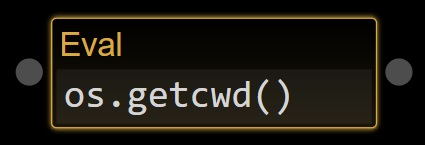
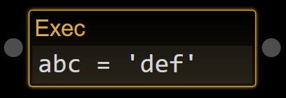
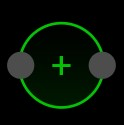
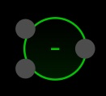
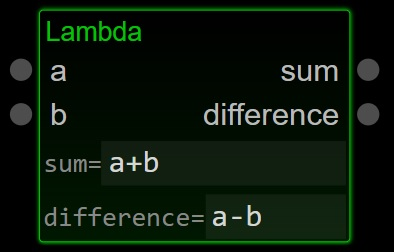
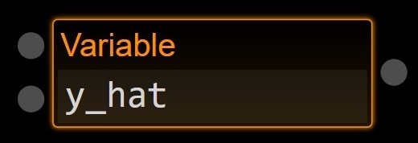
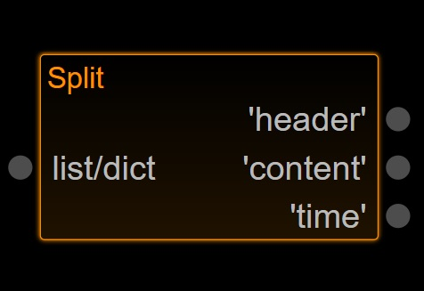

Built-in Nodes
==================

Here is a list of all the built-in nodes in Grapycal. These basic nodes are always handy to use no matter what task
you are working on.

.. [generator please start from below]

Interaction
------------------

Print
~~~~~~~~~~~~~~~~~~~

Display the data received from the input edge.

:Inputs:
    - **data**: data to be displayed

|

Eval
~~~~~~~~~~~~~~~~~~~

Equivalent to Python's `eval` function. It evaluates the expression in the input text box and send out the result.

To make it run, either send in a signal to the `run` input port, or double click on the node.

:Inputs:
    - **run**: send in a signal to evaluate the expression

:Outputs:
    - **result**: the result of the expression

|

Exec
~~~~~~~~~~~~~~~~~~~

Equivalent to Python's `exec` function. It executes the statements in the input text box.

To make it run, either send in a signal to the `run` input port, or double click on the node.

:Inputs:
    - **run**: send in a signal to run the statements
    

:Outputs:
    - **done**: send out a signal when the statements are done

|

ImagePaste
~~~~~~~~~~~~~~~~~~~

.. image:: ./node_imgs/imagepaste.jpg
    :width: 10em
    :align: right
    :alt: [ImagePaste image]

ImageDisplay
~~~~~~~~~~~~~~~~~~~

.. image:: ./node_imgs/imagedisplay.jpg
    :width: 10em
    :align: right
    :alt: [ImageDisplay image]

Label
~~~~~~~~~~~~~~~~~~~

.. image:: ./node_imgs/label.jpg
    :width: 10em
    :align: right
    :alt: [Label image]

Function/math
------------------

Addition
~~~~~~~~~~~~~~~~~~~

Adds a set of values together. The values can be of any addable type, such as numbers, NumPy arrays,
PyTorch tensors, or strings.

:Inputs:
    - **values**: a set of values
    
:Outputs:
    - **sum**: sum of all values

|

Subtraction
~~~~~~~~~~~~~~~~~~~

Calculates sum(`B`) - sum(`A`).

:Inputs:
   - **A**: A set of values, `A`
   - **B**: A set of values, `B`

:Outputs:
    - **Difference**: sum(`A`) - sum(`B`)

|

Multiplication
~~~~~~~~~~~~~~~~~~~

.. image:: ./node_imgs/multiplication.jpg
    :width: 10em
    :align: right
    :alt: [Multiplication image]

Multiplies a set of values together. The values can be of any multipliable type, such as numbers, NumPy arrays, or
PyTorch tensors.

:Inputs:
    - **values**: a set of values

:Outputs:
    - **product**: product of all values

|

Division
~~~~~~~~~~~~~~~~~~~

.. image:: ./node_imgs/division.jpg
    :width: 10em
    :align: right
    :alt: [Division image]

Calculates product(`B`) / product(`A`).

:Inputs:
    - **A**: A set of values, `A`
    - **B**: A set of values, `B`

:Outputs:
    - **Quotient**: product(`B`) / product(`A`)

|

Procedural
------------------

For
~~~~~~~~~~~~~~~~~~~

.. image:: ./node_imgs/for.jpg
    :width: 10em
    :align: right
    :alt: [For image]

Iterate through an iterable object. Each iteration will push the next item to the ``item`` port.
Double click to interrupt the iteration.

|

Event
~~~~~~~~~~~~~~~~~~~

.. image:: ./node_imgs/event.jpg
    :width: 10em
    :align: right
    :alt: [Event image]

Procedure
~~~~~~~~~~~~~~~~~~~

.. image:: ./node_imgs/procedure.jpg
    :width: 10em
    :align: right
    :alt: [Procedure image]

Limiter
~~~~~~~~~~~~~~~~~~~

.. image:: ./node_imgs/limiter.jpg
    :width: 10em
    :align: right
    :alt: [Limiter image]

InPortal
~~~~~~~~~~~~~~~~~~~

.. image:: ./node_imgs/inportal.jpg
    :width: 10em
    :align: right
    :alt: [InPortal image]

OutPortal
~~~~~~~~~~~~~~~~~~~

.. image:: ./node_imgs/outportal.jpg
    :width: 10em
    :align: right
    :alt: [OutPortal image]

Function
------------------

Lambda
~~~~~~~~~~~~~~~~~~~

LambdaNode is one of the most powerful nodes in Grapycal. It allows you to define any function, which is
similar to Python's lambda function.

It can be freely configured to be any function of any number of inputs and outputs. For each output, the node
provides an input box for you to define the function with an expression.

:Inputs:
    - **x**: input 1
    

|

FuncCall
~~~~~~~~~~~~~~~~~~~

.. image:: ./node_imgs/funccall.jpg
    :width: 10em
    :align: right
    :alt: [FuncCall image]

FuncIn
~~~~~~~~~~~~~~~~~~~

.. image:: ./node_imgs/funcin.jpg
    :width: 10em
    :align: right
    :alt: [FuncIn image]

FuncOut
~~~~~~~~~~~~~~~~~~~

.. image:: ./node_imgs/funcout.jpg
    :width: 10em
    :align: right
    :alt: [FuncOut image]

Data
------------------

Variable
~~~~~~~~~~~~~~~~~~~

VariableNode stores a variable in the workspace. It can be used to store data for later use.

:Inputs:
    - **run**: send in a signal to actively output the variable's value
    - **set**: set the variable's value

:Outputs:
    - **get**: get the variable's value

|

Split
~~~~~~~~~~~~~~~~~~~

SplitNode is used to get items from a list or a dictionary using keys.
It is equivalent to `data[key]` in Python.

Multiple keys can be used at the same time. Each value will be sent to a corresponding output port.

:Inputs:
    - list/dict: the list or dictionary to be split

:Outputs:
    - **value1**: the value of the first key
    - **value2**: the value of the second key
    etc.

|

List
~~~~~~~~~~~~~~~~~~~

.. image:: ./node_imgs/list.jpg
    :width: 10em
    :align: right
    :alt: [List image]

