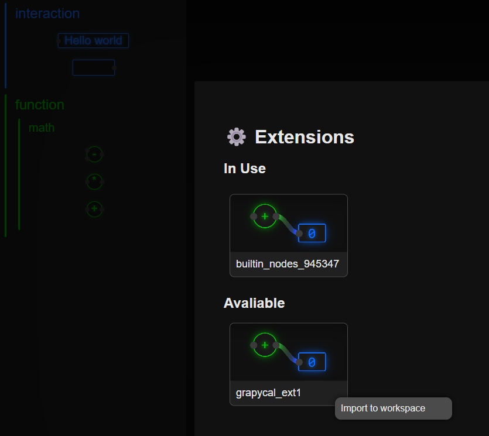
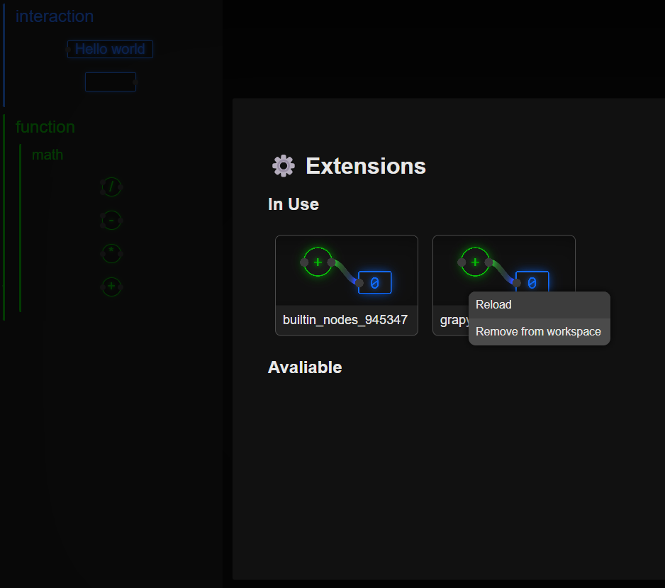

# Grapycal v0.2.0

## 新增的功能:
### Node execution

每種 Node 都會在接收到特定 attribute callback 或 **node event** (如 edge_activated、double_click) 後執行自己的工作。例如 AdditionNode 會在 edge_activated 被呼叫的時候重新把輸入的數字相加，然後把結果輸出。

```python
class AdditionNode(Node):
    def edge_activated(self, edge):
        inputs = [edge.get_data() for edge in self.input_edges]
        self.output_edges[0].push_data(sum(inputs))
```


Attribute callback 或 **node event** 若為使用者的操作所觸發，它會在 communication thread 裡面被呼叫。所以如果 Node 收到 **node event** 之後原地開始做耗時的工作，會 block 住 communication thread，讓使用者無法和 server 互動。為了解決這個問題，Node 的耗時執行工作必須用 run_in_background() 放到 background thread 裡面執行。

```python
def long_time_task(self):
    time.sleep(10) # simulates a long time task

def edge_activated(self, edge):
    self.run_in_background(self.long_time_task)
```

如果工作需時很短，可以直接在 attribute callback 或 **node event** 裡面執行，

```python
def short_time_task(self):
    time.sleep(0.001)
    
def edge_activated(self, edge):
    self.short_time_task()
```

也可以用 run_directly() 來捕獲 output 和 exception，方便呈現在前端。

```python
def short_time_task(self):
    for i in range(10):
        print(i)
        # 會顯示在 node 上面 (但前端這部分還沒寫)
    
def edge_activated(self, edge):
    self.run_directly(self.short_time_task)
```

run_in_background() 、 run_directly() 和都不使用的比較:

| | run_in_background() | run_directly() | 不使用 |
| --- | --- | --- | --- |
| 使用的 thread | background thread | communication thread / background thread (和 event 來源同 thread) | 同 run_directly() |
| 執行長時間的 task 會導致 | 佔用 background thread，後面進來的 task 會排隊 | 使用者無法與 server 互動 | 同 run_directly() |
| 執行須即時回饋的 task 會導致 | 可能需要等待 background thread 空閒才能執行，導致 bad UX | 能即時回饋 | 同 run_directly() |
| output 和 exception 的行為 | 顯示在 node 上面 | 顯示在 node 上面 | 顯示在 console 上面 |

### Saving and loading

使用者可以按 Ctrl+s 把目前的 workspace 轉成 JSON 存成 .grapycal 檔案。下次 workspace 開啟時會自動讀取 .grapycal 檔案。

### Extensions

Extension 是裡面定義很多 node 的 python package。使用者可以在前端選擇要 import 的 extension，然後就可以使用 extension 裡面的 node。Builtin_nodes 是一個無法移除的 extension。例如 grapycal_ext1 裡面定義了除法 node



除法 node 出現在左邊 side bar



在開發 extension 時，改了 node 的 code 之後，可以 reload extension 來更新 node 的定義。reload extension 會把 workspace 中該 extension 的所有 node 都先刪除，重新 import extension 裡面的 node，然後把 node 放回到 workspace 裡面。